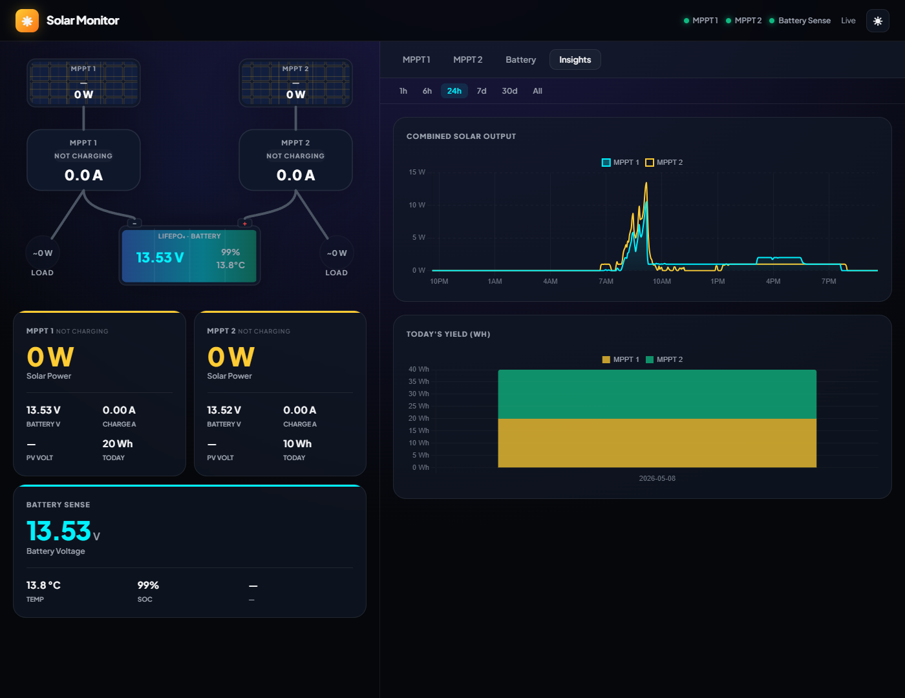
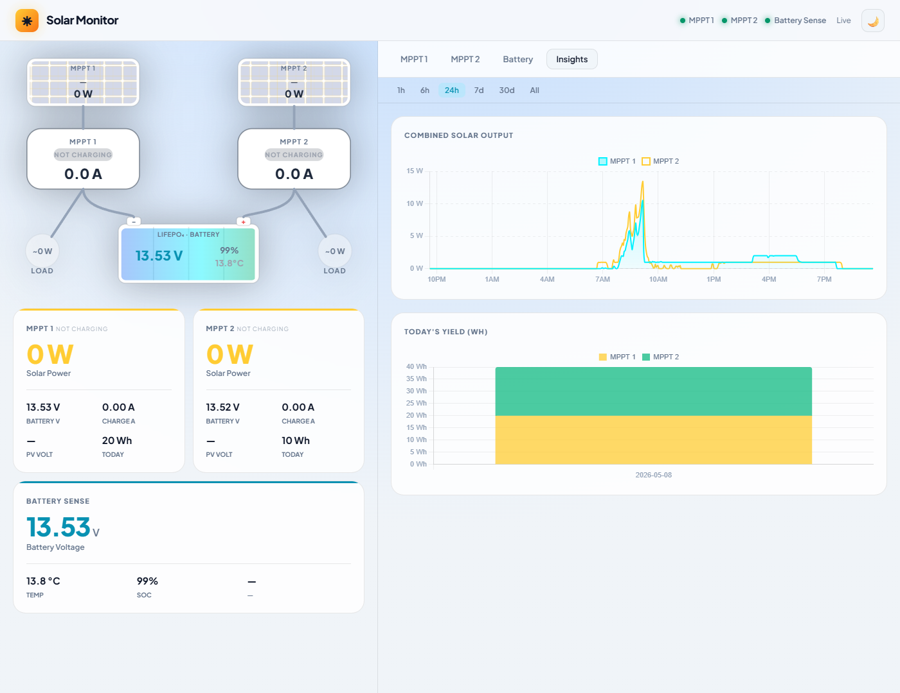
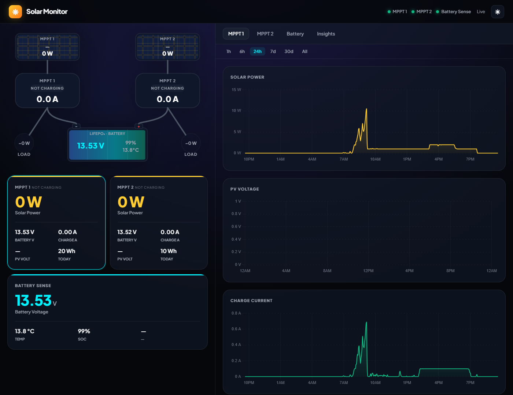
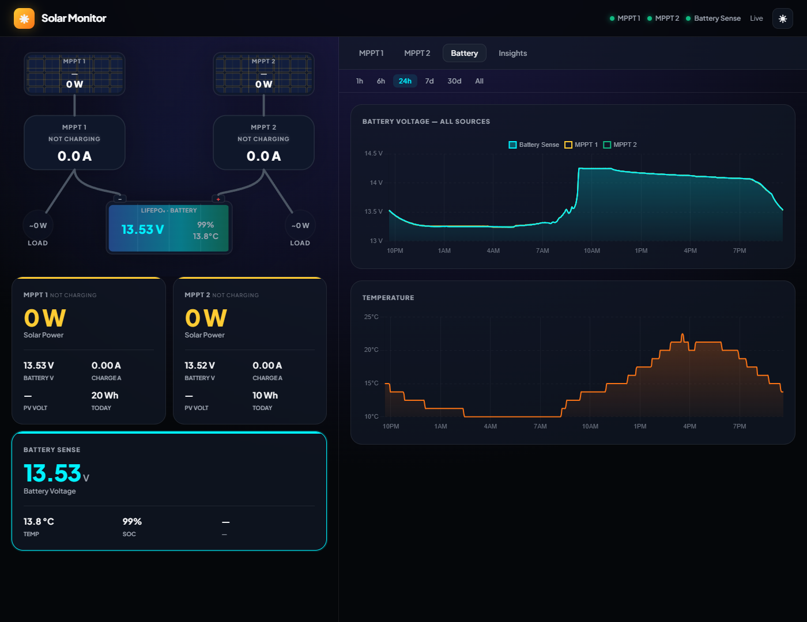

# Victron Solar Monitor

A self-hosted solar energy dashboard for Victron BLE devices — no cloud, no subscriptions, no Victron servers. An ESP32 passively captures BLE advertisements from your Victron devices and feeds a web dashboard you can reach from anywhere over HTTPS.

> **Tested with:** 2× SmartSolar MPPT charge controllers + 1× Smart Battery Sense + ESP32-S3

---

## Screenshots

### Live Energy Flow (dark mode)


### Live Energy Flow (light mode)


### Historical Charts


### Battery


---

## What you get

- **Animated energy flow** — live arrows show power moving solar → charger → battery → load
- **Per-device cards** — PV power, battery voltage, charge current, load, yield today/total, charge state
- **Historical charts** — 1 h / 6 h / 24 h / 7 d / 30 d with automatic resolution (1-second live data always shown for the last hour)
- **Daily yield bars** — timezone-aware so bars never split at UTC midnight
- **Dark / light theme**
- **Google OAuth gate** — only your email can reach the dashboard
- **HTTPS** — Let's Encrypt certificate, accessible from anywhere

---

## What you need

| | |
|---|---|
| **ESP32-S3** dev board | Placed near your Victron devices (BLE range, ~10 m). Flashed once via USB, then updates OTA. |
| **Linux server** | Raspberry Pi, mini PC, or any always-on machine with Docker installed. |
| **VictronConnect app** | To copy the encryption key from each device (one-time, ~30 seconds per device). |
| **Domain name** | For HTTPS remote access. A free subdomain works. |

---

## Installation

Install ESPHome on the machine you'll use to flash the ESP32:

```bash
pip install esphome
```

Then on your Linux server:

```bash
git clone https://github.com/dreamins/victron-dashboard ~/victron-dashboard
cd ~/victron-dashboard && ./setup.sh
```

The wizard handles everything from there — it configures services, obtains a TLS certificate, sets up Google OAuth, and at the right moment prints the exact command to flash the ESP32 from your laptop. Follow the prompts; re-running is safe if you need to resume.

**During the wizard you will be asked to:**
- Open VictronConnect on your phone, tap each device → ⋮ → Product Info, and copy the Encryption Key
- Create a Google OAuth app and paste the Client ID and Secret ([console.cloud.google.com/apis/credentials](https://console.cloud.google.com/apis/credentials))
- Enter your domain name, DNS provider API key (for the TLS certificate), and the email address that gets access

When it finishes, forward port **8443 TCP** on your router to the server's LAN IP and open `https://your.domain.com:8443/`.

---

## License

MIT
