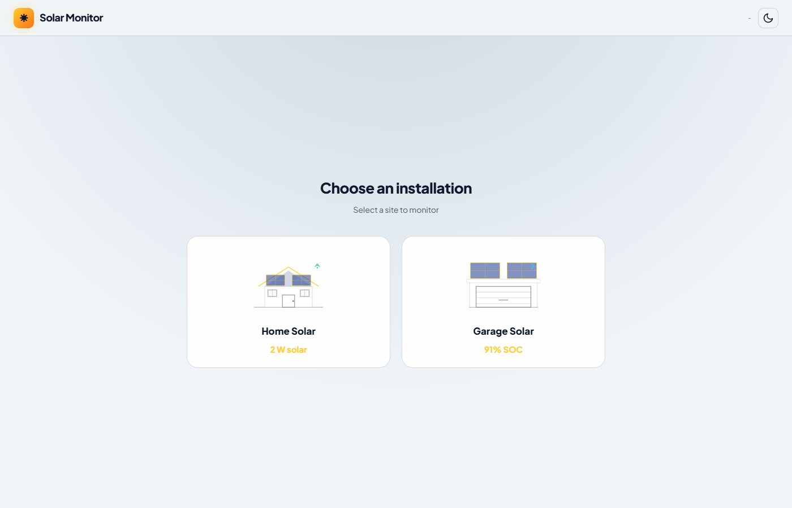
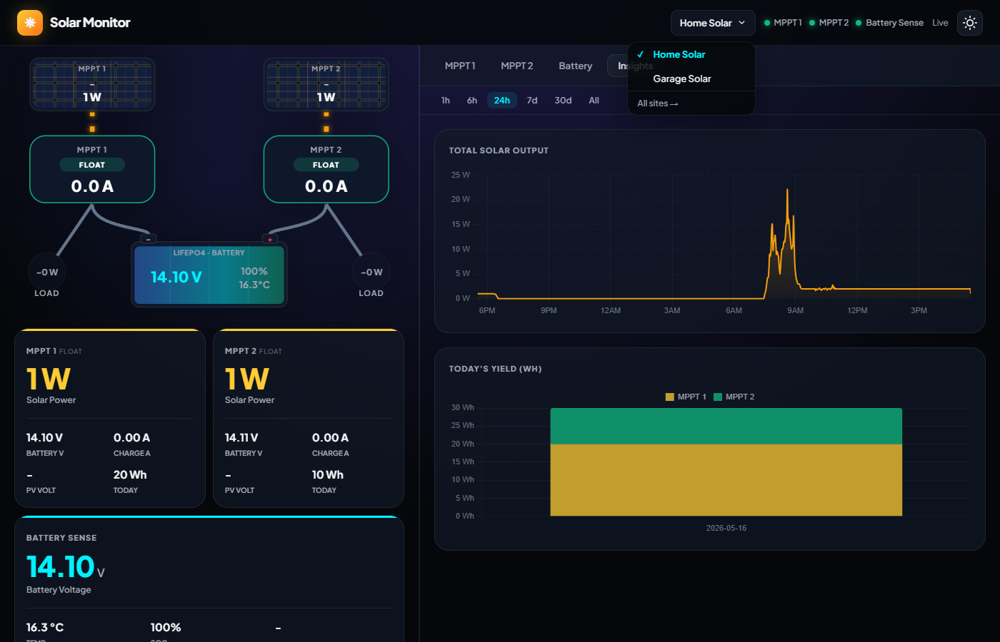
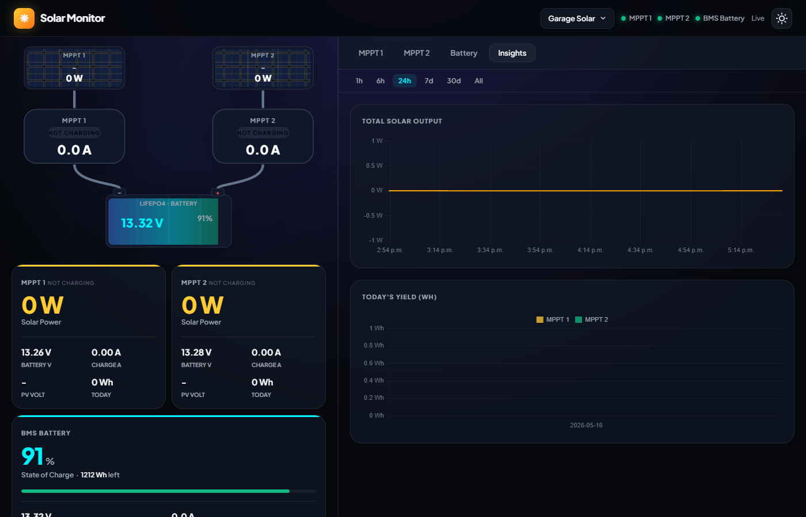
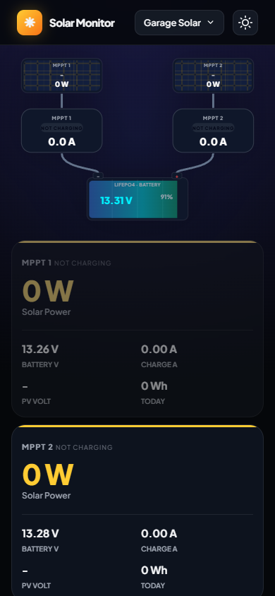

# Victron Solar Monitor

A self-hosted solar energy dashboard for Victron BLE devices — no cloud, no subscriptions, no Victron servers. Monitors multiple installations from a single dashboard with live energy flow, historical charts, and BMS battery tracking.

> **Tested with:** 2× SmartSolar MPPT + 1× Smart Battery Sense (ESP32 bridge) · 2× SmartSolar 150/75 MPPT + LiTime BMS (direct Linux BLE)

---

## Screenshots

### Site Picker


### Live Energy Flow (dark mode)


### Site Switcher


### Garage Dashboard with BMS Card


### Historical Charts


### Mobile


---

## What you get

- **Multi-site** — monitor multiple physical installations from one dashboard; site picker on first load, instant switching via header dropdown
- **Animated energy flow** — live arrows show power moving solar → charger → battery → load (load node hidden for sites without a load)
- **BMS battery card** — for LiTime/EG4 batteries: SOC% hero number, animated charge bar, cell delta, cycles, remaining Wh
- **Per-device cards** — PV power, battery voltage, charge current, yield today/total, charge state per MPPT
- **Historical charts** — 1 h / 6 h / 24 h / 7 d / 30 d with automatic bucket resolution
- **Daily yield bars** — timezone-aware so bars never split at UTC midnight
- **Offline detection** — device and bridge status shown separately in the header
- **Dark / light theme** — persisted across sessions
- **Google OAuth gate** — only your email can reach the dashboard
- **HTTPS** — Let's Encrypt certificate, accessible from anywhere

---

## Architecture

Two bridge paths write to the same InfluxDB instance, tagged by `site`:

```
── Home installation ──────────────────────────────────────────────
 Victron MPPT × 2 + Battery Sense (BLE)
   → ESP32 (ESPHome passive scanner, WiFi)
   → MQTT: victron/home/raw → ble-decoder → InfluxDB  site=home

── Garage installation ────────────────────────────────────────────
 Victron 150/75 MPPT × 2 (BLE passive)
   → ble-bridge (bleak, Linux hci adapter) → InfluxDB  site=garage
 LiTime BMS (BLE active poll every 5 s)
   → ble-bridge → InfluxDB  battery measurement

Both sites ──────────────────────────────────────────────────────
   InfluxDB → solar-api (FastAPI) → nginx + OAuth2 → Dashboard
```

**Home path** uses an ESP32 as a BLE-to-WiFi bridge (no Linux BLE adapter needed near the panels). **Garage path** runs ble-bridge directly on the Linux server, which is physically colocated with the panels and battery — no ESP32 needed.

---

## What you need

| Component | Notes |
|---|---|
| **Linux server** | Raspberry Pi, mini PC, or any always-on machine with Docker. Needs a Bluetooth adapter if bridging a garage/local installation directly. |
| **ESP32-S3** (optional) | Required only for the home/remote path. Placed near Victron devices (BLE range ~10 m), flashed once via USB then updates OTA. |
| **VictronConnect app** | To copy the 32-character encryption key from each device. One-time, ~30 seconds per device. |
| **Domain name** | For HTTPS remote access. A free subdomain works fine. |

**Tested Bluetooth hardware:**
- ESP32-S3 dev board (home path, BT 4.x passive scan)
- TP-Link UB500 (USB dongle, BT 5.1, `hci1`) — needed for BLE 5.0 extended advertising used by some devices
- Built-in server adapter (`hci0`, BT 4.1) — adequate for Victron MPPTs but not BLE 5.0 BMS devices

---

## Installation

On your Linux server:

```bash
git clone https://github.com/dreamins/victron-dashboard ~/victron-dashboard
cd ~/victron-dashboard && ./setup.sh
```

The setup wizard handles everything — Docker stack, InfluxDB, MQTT broker, OAuth2 proxy, TLS certificate. It prompts you for:

- Each device's encryption key (from VictronConnect → device → Product Info)
- Bridge type per installation: `esp32` (MQTT) or `ble` (direct Linux BLE)
- Google OAuth Client ID and Secret ([console.cloud.google.com/apis/credentials](https://console.cloud.google.com/apis/credentials))
- Your domain name, DNS provider API key, and the email address that gets access

If flashing an ESP32 for the home path, the wizard prints the exact command to run from your laptop at the right moment.

When finished, forward **port 8443 TCP** on your router to the server's LAN IP and open `https://your.domain.com:8443/`.

---

## Data model

All measurements are tagged `site` + `device` + `label`.

| Measurement | Fields |
|---|---|
| `solar` | `pv_power`, `pv_voltage`, `battery_voltage`, `charge_current`, `yield_today`, `yield_total`, `charge_state`, `load_current`, `temperature` |
| `battery` | `soc`, `soh`, `cycles`, `temperature`, `battery_voltage`, `battery_current`, `cell_min`, `cell_max`, `cell_avg` |

Four InfluxDB buckets: `victron` (30 d raw), `victron_medium` (1 yr × 5 min), `victron_hourly` (∞ × 1 hr), `victron_test` (24 h for CI).

---

## License

MIT
